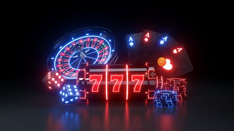
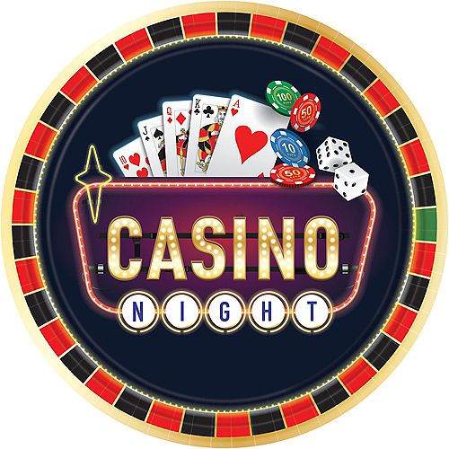
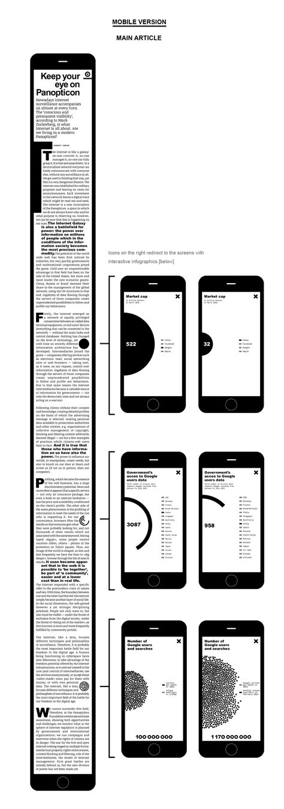
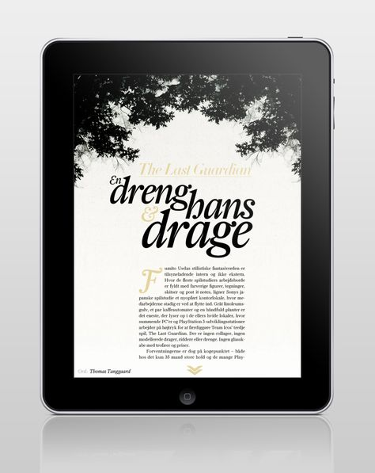
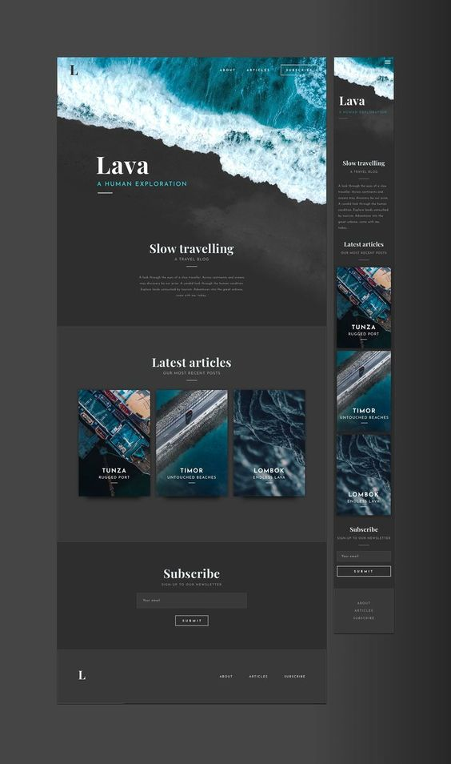
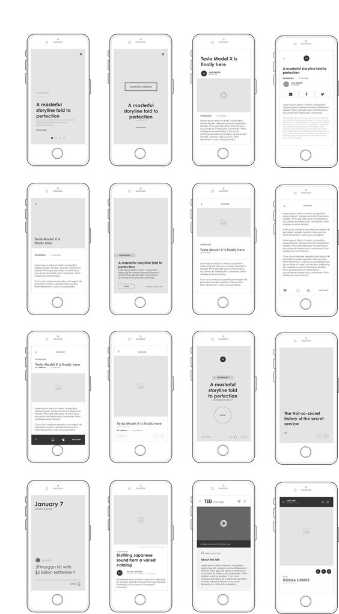

# project-ux-components
Interface Development II Assignment 1

## Assignment Deliverables: 

    1)  Due Dates: 
        - Prototype Due (HTML + CSS): March 13
        - Final Dev Due (JS): March 27
    2)  Component Deliverables: 
        a) Landmarks, Orientation, and Scroll Spy:track users progress through article 
        b) Carousel or Tabbed Component: guides user through content 
        c) Infinitely Load Content: maintain fluidity of experience by loading new content, make user aware of new content
        d) One Component or Tool of your choosing (be creative). 
    3)  Documentation and Design: 
        a) Research in readme.md file with process and problem solving
        b) Breakdown of designs into tasks, doucment functions, listeners and process
        c) UI (overal design aesthetic i.e. colour, spacing)
        d) UX (usability, value added, seamless integration)
        e) Code Structure (indentation, names, readability, best practices)
        f) Portability (scalable, dynamic, cut and paste into new doc and it works)
        g) Quality and interest of article
        h) Responsive design (mobile, tablet, desktop)

## ARTICLE TOPIC: 
"U.I. in social media and mobile apps are being designed to imitate  gambling mechanics."

## COMPONENT DELIVERABLES: 

    a)  Landmark, Orientation + Scroll Spy: 
        -coin slot machine dash 
        -one slot screen per section of the article
        -as user reads/scrolls through a section the related slot icon spins and snaps into place with the winning icon (* star *), other sections spin until their section is done 

    b) Carosusel or Tabbed Component: 
        -sections are sperated into slide-like pages, each seperate, snaps/transitions/scrolls up after the section is done. 
        -can be jumped to by clicking on the section's icon 
        -icons relate to section name/content 

    c) Infinetly Load Content:
        -when user has scrolled to the end of the document all 'winning' icons have locked in place, and the winning sequence goes off, loading the new content/loading the article again. 
        -lights flashing, congratulations, animation, confetti etc. 
        -spinwheel icon loading icon with delay before loading the same document again. 
    d)  One component or tool of your choosing: interactive data
        ????
    

## UI: 

Color-Pallet : Cherry-Red, Black, White, Gold. Maybe accents of Cyan and Magenta, tiny-little-ity-bit of card table green. 

Article Look/Structure INSPO

I love the strong black and white graphic type, with bold as main emphasis. I like the simple dynamic data visualizations

Gold, white and black. Arrows to indicate swipe down to next section, I like the bleed-from black to white on the top

Nice spacing and font variation between h1, h2, and p

a few examples of hwo I might combine text and image throughout the article. 

## Problem Solving: 

Slot machine progress bar

create image for icon slide
track scroll 
track current section 
grid of boxes
place img within box and change position of visible img on scroll. 
img stops scrolling through when its reached certain parts of the article 